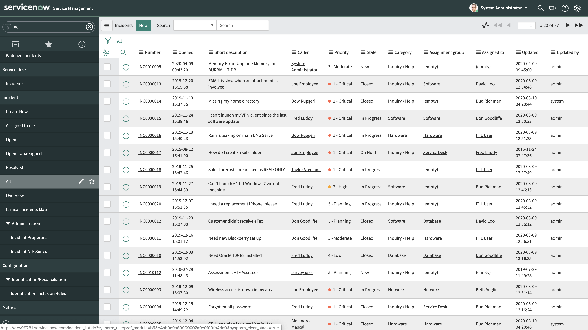
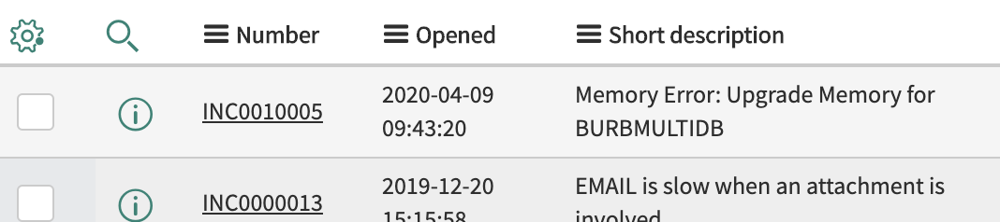
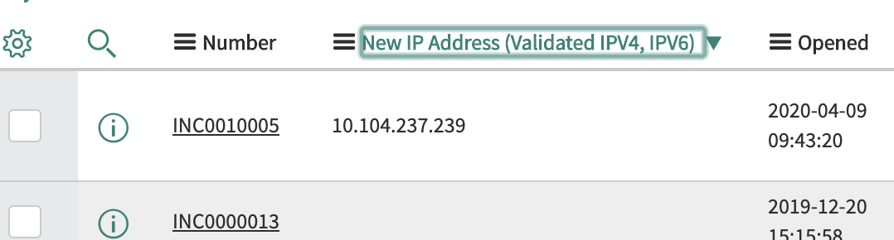
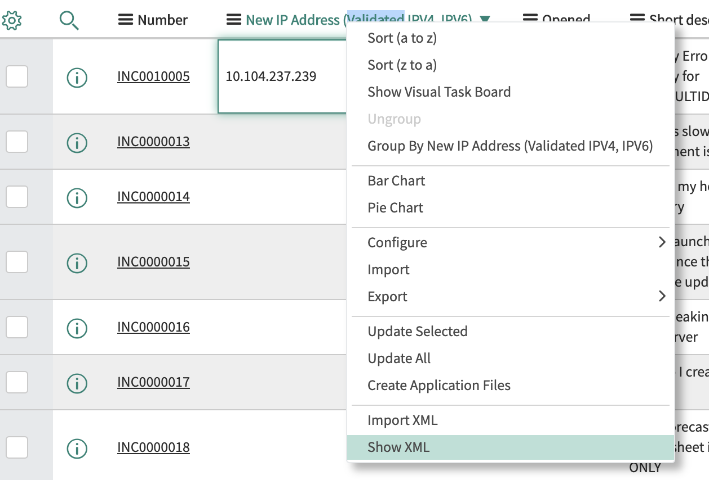
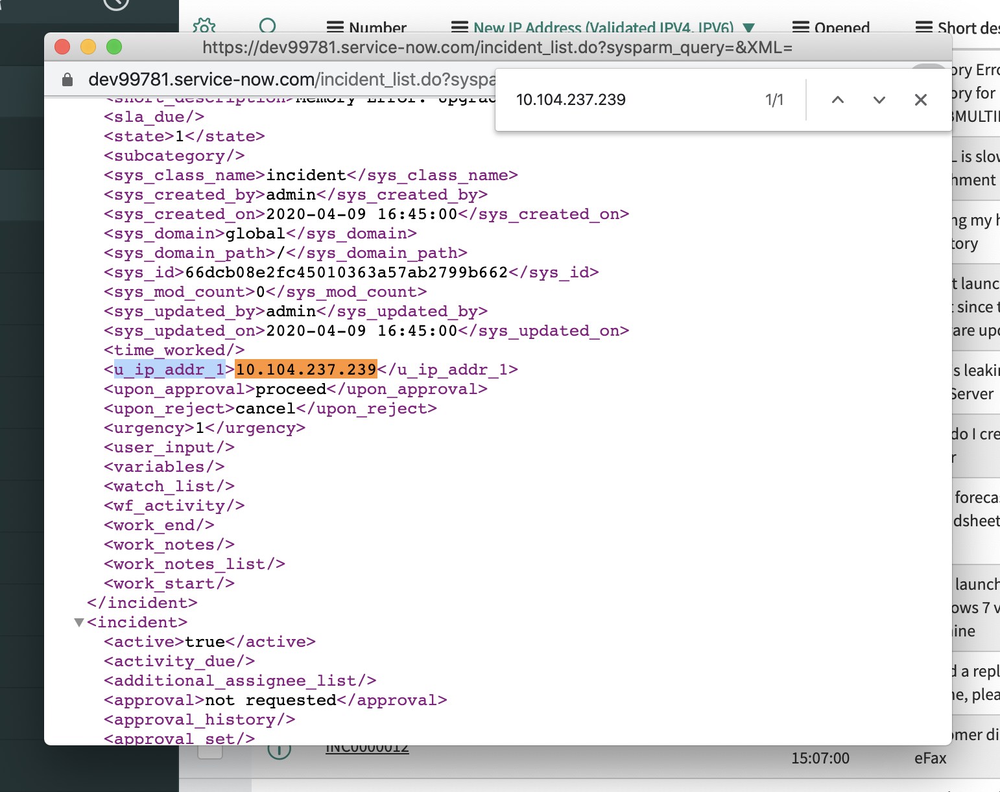

# How to Find Custom Fields for Service Now

1. To find a custom field to search by Service Now for either the incident or asset tables you must first go to the table in the Service Now Dashboard.

2. Once you find the table click on the gear icon in the upper left of that table.

3. Find the field you want to search by and move it over to the selected section.

4. Find that new column in the table and sort by it in a way that allows you to see an example of a row with a value in that column.

5. Copy that example value(`CTRL/CMD + C`), then right click on the header of that new column and select the `Show XML` option.

6. Use search `CTRL/CMD + F` and paste your example value you copied in the previous step into the search field (`CTRL/CMD + V`) and hit `Enter`.  The key you find to the left of your example value will be the key you will use in the Custom Fields Option in your Polarity Dashboard for your Service Now Integration.

