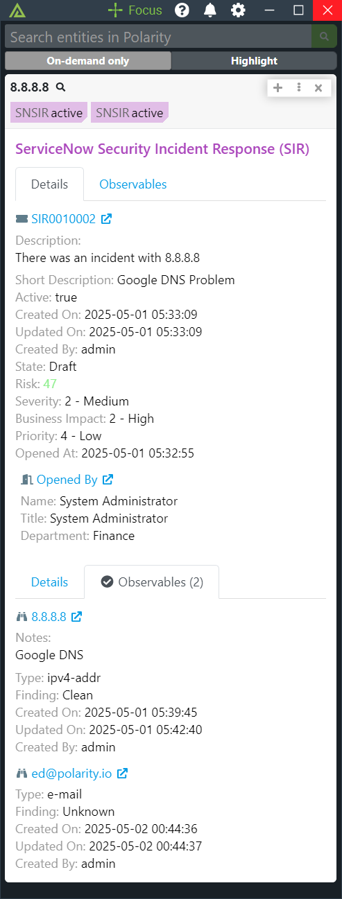

# Polarity ServiceNow Security Incident Response (SIR) Integration

Polarity's ServiceNow Security Incident Response (SIR) Integration allows looking up ServiceNow security incidents by Incident Number (e.g. SIR00000012), as well as searching Incident description and short descriptions.  Additionally, the integration can search associated Observables for an Incident. 

  

To learn more about ServiceNow Security Incident Response (SIR), visit the [official website](https://docs.servicenow.com/bundle/orlando-security-management/page/product/security-incident-response/reference/sir-landing-page.html).

## Required Permissions

The user or API key used to authenticated to ServiceNow SIR requires the following table permissions:

| Table | Permission | Description                                                                                                                        |
| ------ | ------ |------------------------------------------------------------------------------------------------------------------------------------|
| sn_ti_observable | Read | Required to return observable information such as IPv4, CVE, Domain etc.                                                           |
| sn_si_incident | Read | Required for searching incident descriptions and short descriptions as well as looking up incidents by number (e.g., `SIRXXXXXXX`) |
| sn_ti_m2m_task_observable | Read | Required for searching observables and linking them to related incidents |
| sn_si_task | Read | Required for searching task numbers of the format `SITXXXXXXX`                                                                     | 

## ServiceNow Security Incident Response (SIR) Integration Options

### ServiceNow Server URL
The URL for your ServiceNow server which should include the schema (i.e., http, https) and port if required

### Username
The username of the ServiceNow user you want the integration to authenticate as.  The user should have permissions to access the `sys_user`, 'sn_si_task', `sn_si_incident`, `sn_ti_observable`, and `sn_t tables.

### Password
The password for the provided username you want the integration to authenticate as.

### API Key
The API Key used to access ServiceNow's Rest API.  If this is being used, then you will not need to use a Username and Password. This API Key will be prioritized over the username password combination. For more information, [refer to this guide](https://www.servicenow.com/docs/bundle/yokohama-platform-security/page/integrate/authentication/task/configure-api-key.html?state=seamless) for creating API keys in ServiceNow.

When generating the API Key the Auth Parameter should be set to `x-sn-apikey: Auth Header`.

If you use a custom Request Header for your Token, you should set the name of the header via the "API Key Header" option.

### API Key Request Header Name

The API Key request header to be used if authenticating via API Key. Defaults to `x-sn-apikey`.  If you are using the default API key configuration in ServiceNow you will not need to change this value.

## Polarity

Polarity is a memory-augmentation platform that improves and accelerates analyst decision making.  For more information about the Polarity platform please see:

https://polarity.io/
