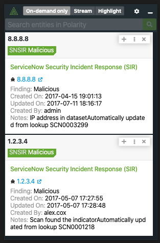

# Polarity ServiceNow Security Incident Response (SIR) Integration

Polarity's ServiceNow Security Incident Response (SIR) Integration allows the lookup of ServiceNow security incidents (e.g. SIR00000012), and Observables including IP addresses, CVE's, web domains, file hashes and e-mail addresses against your instance of ServiceNow.

  

To learn more about ServiceNow Security Incident Response (SIR), visit the [official website](https://docs.servicenow.com/bundle/orlando-security-management/page/product/security-incident-response/reference/sir-landing-page.html).

## Required Permissions

The user or API key used to authenticated to ServiceNow SIR requires the following table permissions:

| Table | Permission | Description |
| ------ | ------ | ------ |
| sn_ti_observable | Read | Required to search indicators such as IPv4, CVE, Domain etc. |
| sn_si_incident | Read | Required for searching incident numbers of the format `SIRXXXXXXX`  |
| sn_si_task | Read | Required for searching task numbers of the format `SITXXXXXXX` | 

## ServiceNow Security Incident Response (SIR) Integration Options

### ServiceNow Server URL
The URL for your ServiceNow server which should include the schema (i.e., http, https) and port if required

### Username
The username of the Service Now user you want the integration to authenticate as.  The user should have permissions to access the `sys_user`, `sn_si_incident`, and `sn_ti_observable` tables.

### Password
The password for the provided username you want the integration to authenticate as.

### API Key
The API Key used to access ServiceNows Rest API.  If this is being used, then you will not need to use a Username and Password. This API Key will be prioritized over the username password combination. For more information, checkout [This Link Here](https://developer.servicenow.com/dev.do#!/learn/learning-plans/paris/servicenow_application_developer/app_store_learnv2_rest_paris_creating_credentials).

## Polarity

Polarity is a memory-augmentation platform that improves and accelerates analyst decision making.  For more information about the Polarity platform please see:

https://polarity.io/
